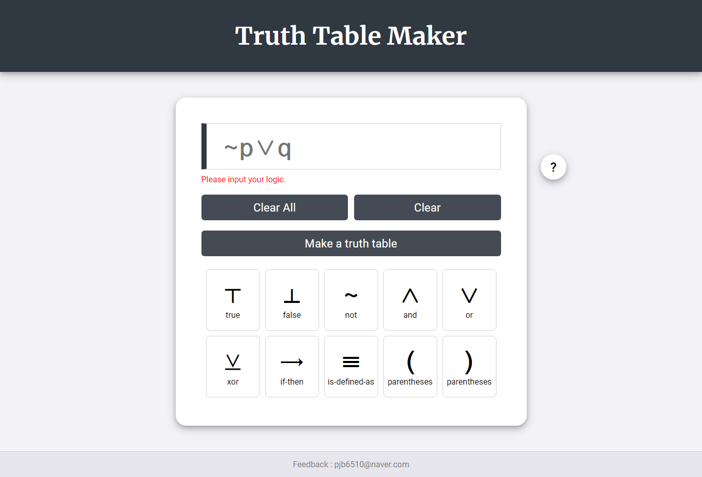
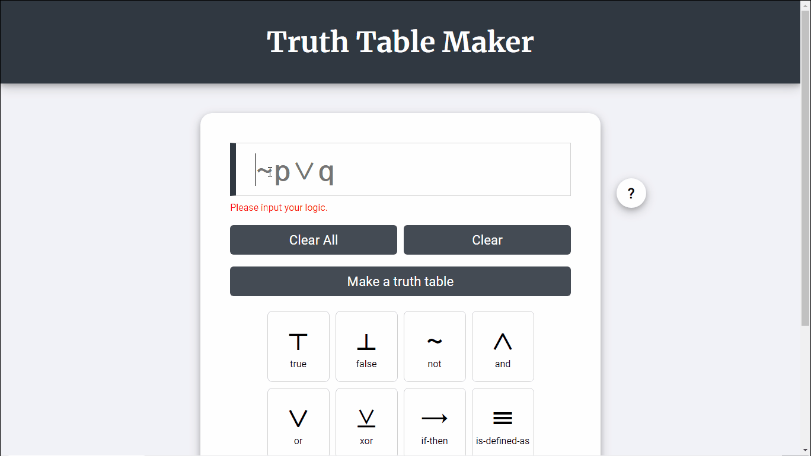
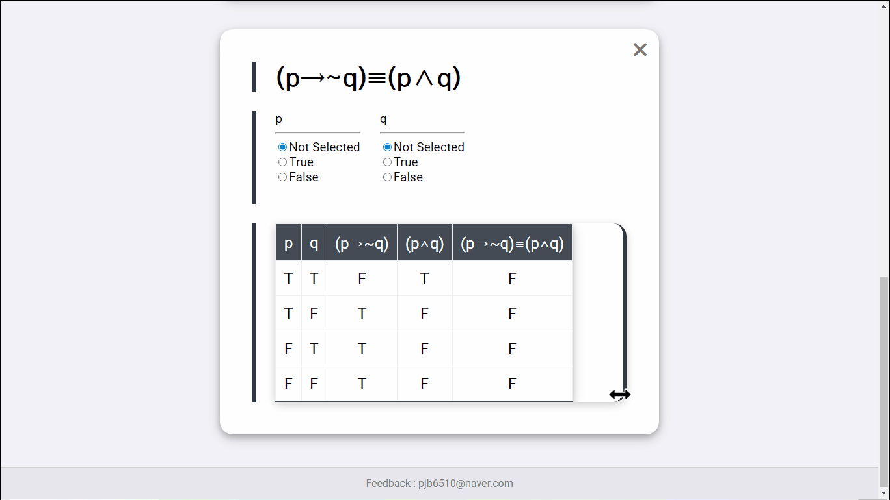
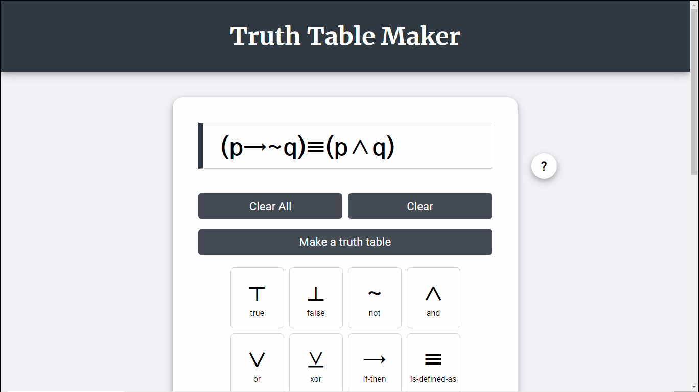
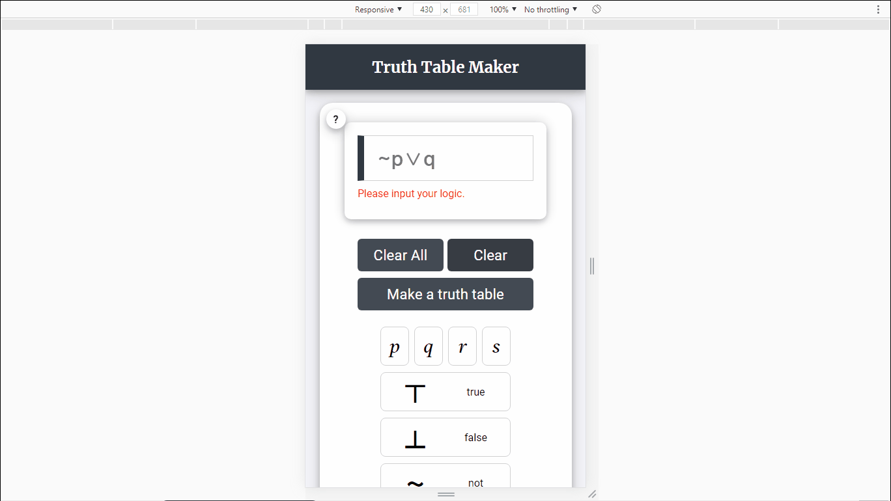
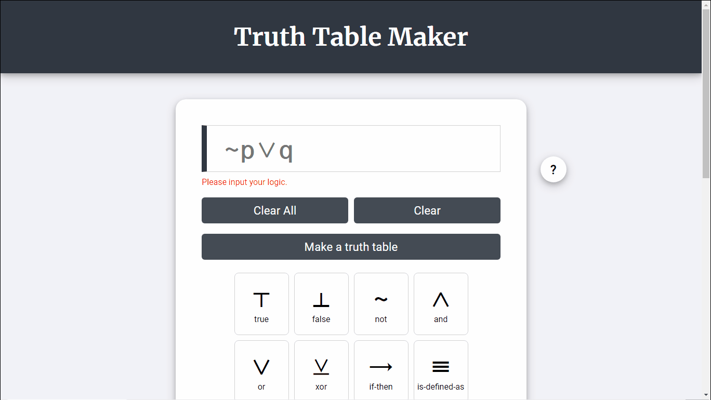

**자바스크립트 입문 도중 진행했던 토이프로젝트입니다. 코드 컨벤션이 지켜지지 않았고, 부족한 점이 많으니 코드를 보실 때는 감안해주시기 바랍니다.**

https://pjb6510.github.io/truth-table-maker/TruthTableMaker.html

# TruthTableMaker

논리식을 입력하면 진리치표를 완성해주는 웹 어플리케이션입니다.

W.C.새먼 - 논리학 을 참고하였습니다.

참고 : [진리표](https://ko.wikipedia.org/wiki/%EC%A7%84%EB%A6%AC%ED%91%9C), [논리 기호](https://ko.wikipedia.org/wiki/%EB%85%BC%EB%A6%AC_%EA%B8%B0%ED%98%B8)

## 사용법

### 1. 입력

- 변수 이름에는 '⊤', '⊥' 그리고 연산자를 제외한 어떤 글자도 사용할 수 있습니다.
- 변수의 수에는 제한이 없습니다. 다만 변수 하나 당 2의 제곱으로 진리치의 경우의 수가 늘어나므로 컴퓨팅 성능의 한계를 고려해야합니다.
- 모든 입력버튼은 마지막 커서의 위치를 기준으로 작동합니다.
- 모든 입력버튼은 숫자, 특정 특수문자와 대응됩니다. 대응되는 숫자, 특수문자를 입력하면 논리기호가 입력됩니다.

| 입력 숫자 | 입력 특수문자 | 입력 결과 |
|-----------|---------------|-----------|
| 1         |               | ⊤         |
| 2         |               | ⊥         |
| 3         | !             | ~         |
| 4         | &             | ∧         |
| 5         | \|            | ∨         |
| 6         | ^             | ⊻         |
| 7         | >             | →         |
| 8         | =             | ≡         |
| 9         |               | (         |
| 0         |               | )         |

### 2. 결과

- 변수 별 진리치 할당으로 해당하는 데이터만 하이라이트 하여 볼 수 있습니다.

- 테이블의 필드를 클릭하면 해당 열의 반전된 값을 볼 수 있습니다.

- PC버전에서는 테이블 뷰포트를 가로로 늘이거나 줄일 수 있습니다.

## 도전 목표

### 1. 반응형 레이아웃

### 2. 도움말 모달 드래그 이동

### 3. 논리식 유효성 검사

다음 조건으로 논리식 유효성 검사를 합니다. 만약 유효하지 않으면 에러 메시지를 표시합니다.

- 여는 괄호와 닫는 괄호의 수가 같아야 합니다.
- not연산자는 다른 연산자와 붙어 있을 수 없습니다.
- 연산자로 논리식이 시작하거나 끝날 수 없습니다.
- 값(⊤, ⊥, 명제 변수) 또는 연산자가 연속으로 등장할 수 없습니다. 논리식에선 반드시 값, 연산자가 번갈아 등장해야합니다. (단, not연산자는 단항연산자이므로 값에 종속되어있는 것으로 간주합니다.)

### 4. 논리식 토큰화

사용자가 입력한 논리식을 한 글자씩 읽어가면서, 값과 연산자를 구분하여 정리합니다.

- 논리식을 읽는 도중, not연산자를 만나면 not연산자 등장횟수를 1씩 증가시키며 저장해둡니다. 이후 논리식에서 값을 만나면, 값을 객체화 하고 값객체에 지금까지 쌓아온 not연산자 등장횟수를 속성으로 부여합니다. 값에 not연산자 등장횟수가 부여되면 not연산자 등장횟수를 초기화합니다.
- 값을 만나면, 값을 객체화 한 후, 누적된 not연산자 등장횟수를 값에 부여합니다. 만약 이미 앞서 등장한 이항 연산자(not연산자를 제외한 연산자)가 있다면 연산자의 right값 속성으로 부여됩니다. 그렇지 않다면, 다음 최초 등장 연산자의 left값 속성으로 넘기기 위해 저장해둡니다.
- 연산자를 만나면, 연산자를 객체화 합니다. 만약 최초로 등장한 연산자라면 저장해 둔 가장 최근의 값을 left값 속성으로 부여받습니다. 최초로 등장한 연산자가 아니라면 **left값으로 값이 아닌 가장 최근에 등장한 연산자를 속성으로 부여받습니다.** 현재 연산자는 이후 등장할 연산자의 left값 속성으로 넘기기 위해 저장해둡니다.
- 여는 괄호를 만나면 괄호 안 논리식을 구분하여, 재귀적으로 토큰화를 진행합니다. 괄호 안 토큰들은 배열로 묶습니다. 하나의 괄호도 값으로 간주하며, 이전에 누적된 not연산자 등장횟수가 있다면 속성으로 부여합니다.

### 5. 논리식 계산

토큰화가 끝나면 객체화된 각 토큰들을 분석하여 계산을 진행합니다.

- 고정 값인 ⊤, ⊥은 각각 True, False로만 취급됩니다. 그 외 모든 명제 변수들로 만들어질 수 있는 모든 경우를 생성합니다.
- 계산은 연산자들만으로 진행합니다. 연산자 객체들에 부여된 left값 과 right값을 계산합니다. 만약 값이 배열(괄호)이라면 재귀적으로 먼저 실행합니다. left값이 연산자라면 left값인 연산자의 결과 먼저 실행합니다.

## 총평

처음엔 True, False만 계산하면 간단하게 구현될 줄 알았는데, 논리식 분석과 계산에서 고민해야할 문제가 많아서 쉽지 않았습니다. 쉽지 않았던 만큼, 이제 막 배워 익숙치 않은 재귀호출을 프로젝트에서 사용해볼 수 있었던 점이나, 논리식을 토큰화 하는 과정에서 어떻게 자료구조를 짜야할 지 고민해볼 수 있었던 점 등 얻어가는 것도 많았습니다.

철학과에서 논리학 수업을 들으면서, 이런 프로그램이 있으면 좋을 것 같다고 생각하며 꽤 오래 묵혀두었던 아이디어였습니다. 코드는 여러모로 부족하지만 직접 기획한 프로그램을 구현해내니, '내가 코딩을 배우고 있구나' 하는 실감도 들고 감개무량합니다.
